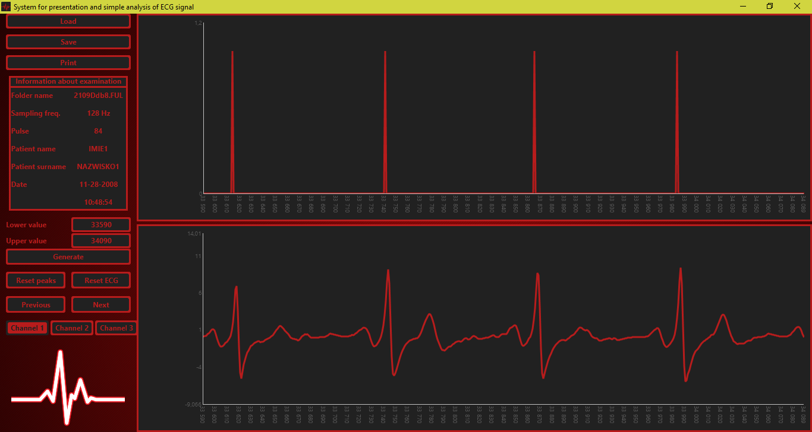

# System do prezentacji i podstawowej analizy sygnału EKG :heart:
 

Aplikacja ma za zadanie umożliwić użytkownikowi przeglądanie zapisów Holterowskich. 
Użytkownik ma możliwość: 
* przeglądania zapisów EKG
* ustalania zakresów
* przybliżania przebiegów
* zapisywania sygnałów do plików graficznych
* zapoznania się z danymi dotyczącymi badania

Aplikacja wyznacza miejsce występowania załamków R, które zostały wyznaczone przy użyciu obliczeń matematycznych
wzorowanych na algorytmie Pana - Tompkinsa 
Aplikacja działa dla danych pochodzących z urządzeń firmy CardioScan oraz Reynolds 

---

# System for presentation and simple analysis of ECG signal :heart:

Application allows view Holter recordings 
User has a possibility to: 
* view ECG waveform
* set scope
* zoom waveform
* save signal as a image files
* check information about examination

Application determines samples for which appears R-wave. Math calculations based on Pan - Tompkins algorithm were
applied for this purpose 
Application works for data from CardioScan devices and Reynolds devices. 

Heart monitor icon credits: https://icons8.com/web-app/14835/Heart-Monitor 
JFXUtils library on Apache 2.0 license written by gillius